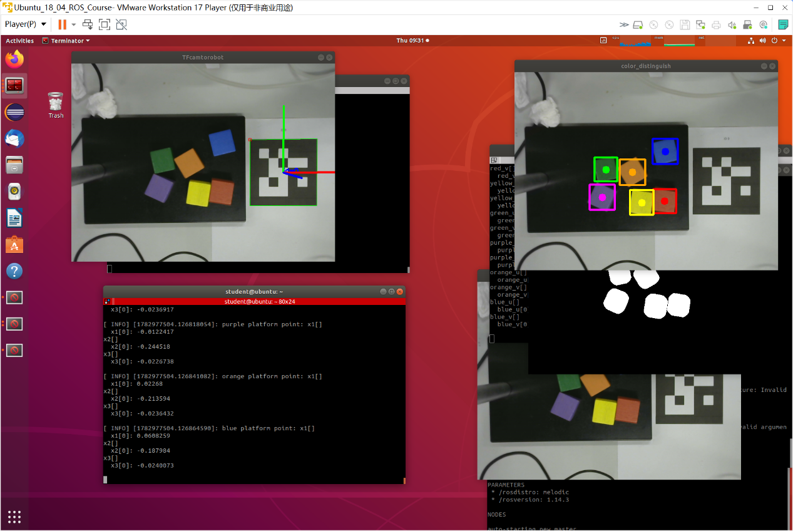
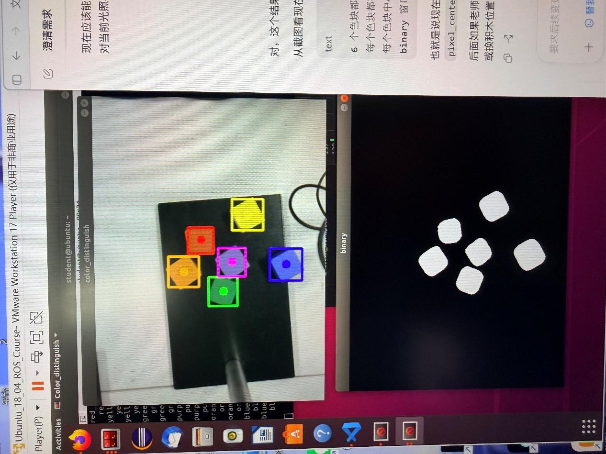
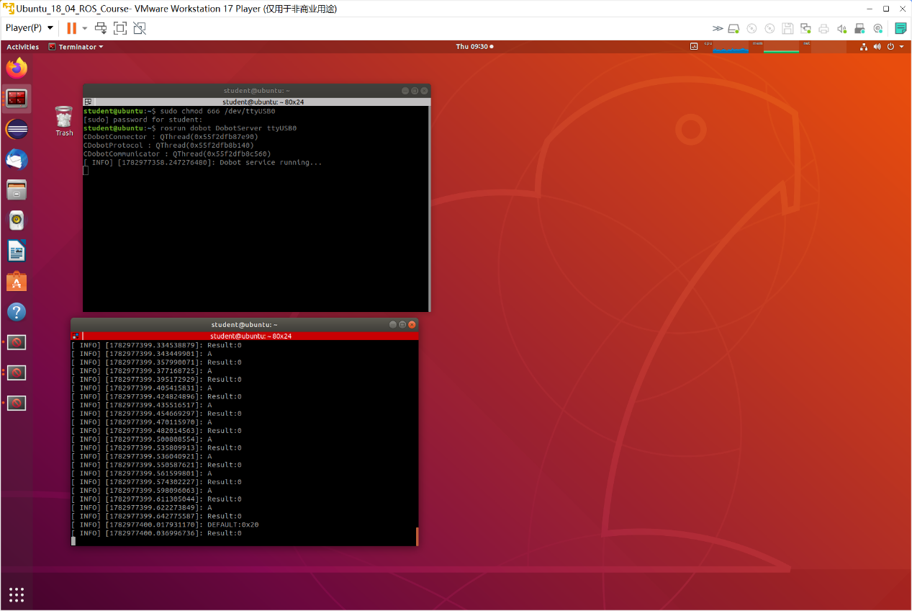

# 桌面级机械臂颜色分拣系统

浙江工业大学 信息工程学院 自动化　机器人控制课程设计
高宇辰（302023510072）　指导老师：禹鑫燚
2026 年 6 月 – 7 月

用 ROS 做的一套视觉引导机械臂分拣系统：USB 相机采图，OpenCV 识别六种颜色的物块，算出物块位置后控制 Dobot Magician 去抓取，按颜色分开放。

## 运行效果

RViz 里的坐标轴和机械臂位姿：



左边是识别结果，右边是绿色通道的二值化掩膜：



DobotServer 连上机械臂之后的运动指令日志：



## 环境

- Ubuntu 18.04 LTS，跑在 VMware Workstation 虚拟机里
- ROS Melodic（`rosversion -d` 显示 melodic 1.14.x）
- OpenCV 4
- 相机：Logitech C270i
- 机械臂：Dobot Magician，末端装气动吸盘
- 标定板：8×6 内部角点，方格边长 0.024 m
- ArUco：DICT_5X5_100，标记边长 0.10 m

关于 ROS 版本：实验报告里写的是 Ubuntu 20.04 + ROS Noetic，那是笔误。实际用的是 18.04 + Melodic，终端截图和 `src/axif_tf/CMakeLists.txt` 里的 `tf2_ros` 依赖都能对上。

## 目录

```
src/
├── opencvtest/            颜色识别节点
│   ├── src/sorting.cpp        394 行
│   └── msg/pixel_point0.msg   自定义消息，存六种颜色的 u/v 坐标
├── axif_tf/               ArUco 检测
│   └── src/getmarker.cpp      105 行
└── dobot/                 Dobot 控制
    └── src/DobotClient_PTP.cpp

docs/
├── 机器人控制课程设计实验报告.docx
└── images/
```

catkin_make 编出来五个可执行文件：`sorting`、`getmarker`、`DobotClient_PTP`、`DobotServer`、`usb_cam_node`。

### 说明一下完整性

这个仓库是从旧工作区里恢复出来的。`usb_cam` 驱动包和 Dobot 官方的 SDK、Qt/ICU 动态库都没放进来——那些是厂商的东西，加起来 227 MB。

三个自己写的文件里：

- `sorting.cpp` 是完整的，六色识别、取色工具、消息发布都在
- `getmarker.cpp` 做到了 ArUco 检测和位姿估计，但**没有写 TF 变换广播那部分**
- `DobotClient_PTP.cpp` 是在 Dobot 官方例程基础上改的，PTP 参数配好了，但**没有按颜色排序的分拣动作序列**

坐标变换那块（`transform_base` 节点）的源码在恢复的时候没找到，现在只存在于实验报告里，报告里有变换公式和手动测量出来的参数。这部分的设计过程和调试记录在报告第 4 章。

## 颜色识别

节点名 `color_distinguish`，源码在 `src/opencvtest/src/sorting.cpp`。

订阅 `/usb_cam/image_raw`，发布 `pixel_center_axis`，消息类型是 `opencvtest::pixel_point0`，里面是六种颜色各自的 u、v 坐标数组。

处理流程：

```
BGR 图 → cvtColor 转 HSV → inRange 二值化 → medianBlur(25×25)
       → findContours 找外轮廓 → boundingRect 面积筛选 → 算中心坐标
```

中心坐标就用外接矩形的两个角算：

```cpp
double center_u = 0.5 * (rect.tl().x + rect.br().x);
double center_v = 0.5 * (rect.tl().y + rect.br().y);
```

六种颜色的 HSV 阈值，都是在实际光照下调出来的：

| 颜色 | H_min | H_max | S_min | S_max | V_min | V_max |
|---|---|---|---|---|---|---|
| 红色区间1 | 0 | 10 | 43 | 255 | 46 | 255 |
| 红色区间2 | 156 | 180 | 43 | 255 | 46 | 255 |
| 橙色 | 11 | 25 | 43 | 255 | 46 | 255 |
| 黄色 | 26 | 34 | 43 | 255 | 46 | 255 |
| 绿色 | 35 | 77 | 43 | 255 | 46 | 255 |
| 蓝色 | 100 | 124 | 43 | 255 | 46 | 255 |
| 紫色 | 125 | 155 | 43 | 255 | 46 | 255 |

红色要用两段区间。HSV 是个环形，红色正好跨在 0° 上，只取一段会漏掉一半。所以单独写了个 `processRed()`：

```cpp
inRange(hsv, Scalar(0,   43, 46), Scalar(10,  255, 255), mask1);
inRange(hsv, Scalar(156, 43, 46), Scalar(180, 255, 255), mask2);
bitwise_or(mask1, mask2, mask_combined);
medianBlur(mask_combined, mask_combined, 25);
```

另外在识别窗口上加了个鼠标回调：点画面上任意一点，终端就打印那点的 BGR 和 HSV 值。因为 HSV 阈值跟光照关系太大，换个位置就得重新取色。这个工具是当时为了调阈值临时加的，后来一直在用。

自定义消息很简单，就是十二个数组：

```
string name
float64[] red_u
float64[] red_v
float64[] orange_u
float64[] orange_v
float64[] yellow_u
float64[] yellow_v
float64[] green_u
float64[] green_v
float64[] blue_u
float64[] blue_v
float64[] purple_u
float64[] purple_v
```

## ArUco 检测和相机标定

节点是 `axif_tf`，源码 `src/axif_tf/src/getmarker.cpp`。

```cpp
dictionary = cv::aruco::getPredefinedDictionary(cv::aruco::DICT_5X5_100);
cv::aruco::detectMarkers(marker_image, dictionary, corners, ids);
cv::aruco::estimatePoseSingleMarkers(corners, 0.10, camera_matrix, dist_coeffs, rvecs, tvecs);
cv::aruco::drawAxis(marker_image, camera_matrix, dist_coeffs, rvecs, tvecs, 0.1);
Zc = tvecs[0][2];
```

先检测标记的四个角点，再用 PnP 算出相机相对标记的位姿，得到旋转向量 `rvec` 和平移向量 `tvec`。`rvec` 用 Rodrigues 变换能转成 3×3 旋转矩阵。`tvec` 的 Z 分量就是深度 `Zc`，后面把像素坐标换算成相机坐标要用到。

相机内参是用张正友棋盘格法标出来的，结果直接写在源码里：

```cpp
camera_matrix = [ 833.5051,   0,       330.5683;
                  0,          833.8074, 255.7232;
                  0,          0,        1       ]

dist_coeffs = [0.04509, 0.22342, 0.004863, 0.004637, 0]
```

标定命令：

```bash
rosrun camera_calibration cameracalibrator.py \
    --size 8x6 --square 0.024 \
    image:=/usb_cam/image_raw camera:=/usb_cam
```

拿到深度之后，像素坐标转相机坐标：

```
Xc = (u - cx) * Zc / fx
Yc = (v - cy) * Zc / fy
```

再往机械臂基座坐标转的一步是在 TF 树上做的，报告里用的是：

```cpp
transformPoint("dobot_base", point_in_camera, point_in_base);
```

`world` 到 `dobot_base` 的平移量是拿卷尺量的，`(-0.143, 0.258, 0.138)` 米，旋转当成单位矩阵处理（两个坐标系方向一致）。

前面说过，这个变换节点的代码没能恢复出来。

## 机械臂控制

源码 `src/dobot/src/DobotClient_PTP.cpp`，是照 Dobot 官方例程改的。

调用的服务有：

- `SetPTPCmd` 点位运动
- `SetEndEffectorParams` 设末端偏移
- `SetEndEffectorSuctionCup` 吸盘吸放
- `SetHOMECmd` 回零
- `SetPTPJumpParams` 门型运动抬升高度和 Z 轴限位
- `SetPTPCommonParams` 速度、加速度比例

参数：

```cpp
srv5.request.xBias = 70;              // 吸盘相对末端的 x 向偏移，单位 mm
srv.request.velocity = 100;
srv.request.acceleration = 100;
srv.request.xyzVelocity = 100;
srv.request.jumpHeight = 20;
srv.request.zLimit = 200;
srv.request.velocityRatio = 50;
srv.request.accelerationRatio = 50;
```

`xBias` 这个参数挺关键。机械臂按运动学算出来的位置去抓，实际会偏，因为吸盘装在末端上有个物理偏移量。把这个值补偿进去之后偏差才下来。

顺带一提，报告里写的补偿值是 61，代码里最后用的是 70，中间调过几版。

## 调试过程中遇到的问题

这些是实际卡住过的地方，报告第 4 章写得更细。

**摄像头在虚拟机里认不出来。** `ls /dev/video*` 没有任何输出。原因是 VMware 需要手动把 USB 设备挂到虚拟机里，不是插上就自动认。在虚拟机菜单的"可移动设备"里手动连接，再把 USB 兼容性设成 3.1 才行。

**`/dev/video0` 打不开。** `v4l2-ctl -d /dev/video0 --all` 报 `Cannot open device`。当前用户不在 `video` 组里，权限不够。临时用 `sudo chmod 666 /dev/video0`，或者 `sudo usermod -a -G video $USER` 之后重新登录。

**usb_cam 报 `frame mapping timeout (11)`。** 摄像头起不来，一直报帧映射超时。查下来是虚拟机的 USB 带宽不够。把 USB 控制器升到 3.1，`pixel_format` 从 mjpeg 改成 yuyv，分辨率降下来，帧率从 30 降到 10，才稳定。

**MJPG 解码失败。** 报 `No JPEG data found in image` 和 `FFMPEG: error passing frame to decoder context`。摄像头本身支持 MJPG，但虚拟机里 USB 传输不稳，JPEG 包传坏了。换成 YUYV 原始格式，让 usb_cam 做软件转换，帧率降到 5–10 fps。结论就是虚拟机环境下稳定比高效重要。

**标定的时候 CALIBRATE 按钮一直是灰的。** 反复移动标定板也点不动。原因是标定板移动的范围不够，没有覆盖画面的四个角和中心，算法要求 X、Y、Size、Skew 四个方向都有变化才行。后来慢慢移动覆盖全画面，同时注意别反光。

**识别结果一直是 0。** 节点跑着没问题，但六种颜色的计数全是 0。HSV 阈值跟实际物块对不上，面积阈值区间也太窄。写了个鼠标取色工具，量出物块真实的 HSV 值重新标定阈值，面积阈值从 6000~10000 改成 1000~15000。这个问题的教训是 HSV 阈值跟光照绑得太死，换个环境必须重新标。

**编译找不到 `tf` 包。** 报 `Could not find a package configuration file provided by "tf"`。新版 ROS 里 `tf` 已经被 `tf2_ros` 和 `tf2_geometry_msgs` 替代了。改 CMakeLists 里的依赖，头文件引用也一起改。

**OpenCV 版本对不上。** 报 `Could not find a configuration file for package "OpenCV" compatible with requested version "3"`。系统装的是 OpenCV 4，但 CMakeLists 里写死了 3。把版本号去掉，`find_package(OpenCV REQUIRED)`，让它自动适配。

**机械臂连不上。** `rosrun dobot DobotServer ttyUSB0` 起不来。两个原因：串口设备权限不够，以及实际设备号不一定是 ttyUSB0。先用 `ls /dev/ttyUSB*` 确认真实设备号，再 `sudo chmod 666` 给权限。串口每次重新插拔后都要重设一次权限。

**抓取位置偏移。** 实际到位的位置跟预期差 1 cm 以上。末端吸盘有物理偏移没补偿，加上机械臂没回零。在 `SetEndEffectorParams` 里设 `xBias` 补偿，PTP 运动前先执行 `SetHOMECmd` 回零，偏差才降下来。

## 学到的东西

ROS 这套东西是第一次完整用起来。整个系统跑起来有七个以上的节点，话题和服务两种通信方式都用到了，rviz、rqt_graph、rostopic 这些工具也是在这个过程中熟悉起来的。节点之间松耦合的设计确实方便，改一个节点不用动其他节点。

视觉这块，HSV 颜色空间、中值滤波、轮廓检测、张正友标定、ArUco 位姿估计都亲手做了一遍，比只看书理解得深。最大的体会是视觉算法的效果跟环境关系极大，同一套参数换个光照就完全不准。

工程上最费时间的其实是环境问题——USB 挂载、串口权限、虚拟机配置、CMake 依赖，这些跟算法没关系但能卡一整天。后来养成了先看日志再动手的习惯。比如摄像头采集失败那一次，是依次排查了 USB 挂载、用户组权限、USB 带宽、像素格式四个方向才定位到的。

## 后续可以做的

- 把 HSV 阈值法换成深度学习方法，解决光照适应性问题
- 把 TF 变换节点补全，让坐标变换链完整进版本管理
- 加避障，优化运动轨迹
- 加异常检测和自动恢复
- 迁到 ROS2

## 参考

- ROS Wiki：[usb_cam](http://wiki.ros.org/usb_cam)、[camera_calibration](http://wiki.ros.org/camera_calibration)、[tf2](http://wiki.ros.org/tf2)
- OpenCV 的 ArUco 检测、Rodrigues 变换、PnP
- Dobot 官方 ROS 例程
